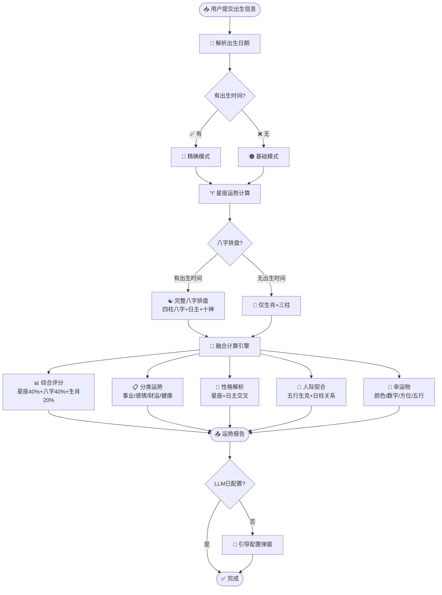
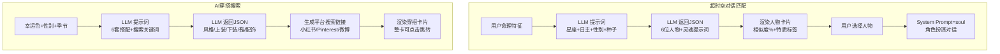

# ⚙️ 运势推算流程图 — 今日运势分析器 v2.0

---

## 第一层：计算主流程



## 第二层：八字排盘详细流程

```mermaid
flowchart TD
    Input[📅 输入: 年/月/日/时] --> Year[📆 年柱\n(year-4)%10→天干\n(year-4)%12→地支]
    Year --> Month[📆 月柱\n节气判定月份地支\n五虎遁推算月干]
    Month --> Day[📆 日柱\n距离2000-01-01天数\nmod60推日干支]
    Day --> Hour[📆 时柱\n时辰划分地支\n五鼠遁推算时干]
    Hour --> Master[👤 日主=日柱天干]
    Master --> TenGods[⚖️ 十神分析\n日主与其他天干关系]
```

## 第三层：融合评分算法

```mermaid
flowchart TD
    Start([各模块分数就绪]) --> Weights[⚖️ 权重配置]

    Weights --> W1[星座运势: 40%]
    Weights --> W2[八字命理: 40%]
    Weights --> W3[生肖运势: 20%]

    W1 & W2 & W3 --> HasTime{有出生时间?}

    HasTime -->|✅ 有| FullWeight[完整权重\n星座40%+八字40%+生肖20%]
    HasTime -->|❌ 无| Fallback[降级权重\n星座60%+生肖40%]

    FullWeight --> Calc[🔢 综合评分 = Σ(模块分×权重)]
    Fallback --> Calc

    Calc --> Level{评分等级}
    Level -->|90-100| Great[🟢 极佳]
    Level -->|75-89| Good[🟢 良好]
    Level -->|60-74| Normal[🟡 平稳]
    Level -->|40-59| Caution[🟠 稍低]
    Level -->|0-39| Warning[🔴 低迷]

    Great & Good & Normal & Caution & Warning --> Summary[💬 一句话总结\n最高分维度+最低分维度动态组合]
```

## 第四层：LLM 扩展流程（穿搭+超时空）



## 数据流

| 输入 | 处理 | 输出 |
|------|------|------|
| 出生年/月/日 | 查找星座+生肖 | 星座运势分+生肖运势分 |
| 出生年/月/日/时 | 排八字四柱+十神 | 八字运势分+日主性格 |
| 各模块分数 | 加权融合算法 | 综合评分 0-100 |
| 最高/最低分维度 | 动态文案组合 | 一句话总结 |
| 星座+日主 | 交叉对比引擎 | 性格解析 |
| 日柱+星象 | 人际匹配引擎 | 宜近/宜远特质 |
| 幸运色+性别+季节 | LLM 搜索 | AI穿搭推荐+平台链接 |
| 命理特征 | LLM 匹配 | 历史人物+角色聊天 |

---

*推算流程图 v2.0 · 含LLM扩展流程*
