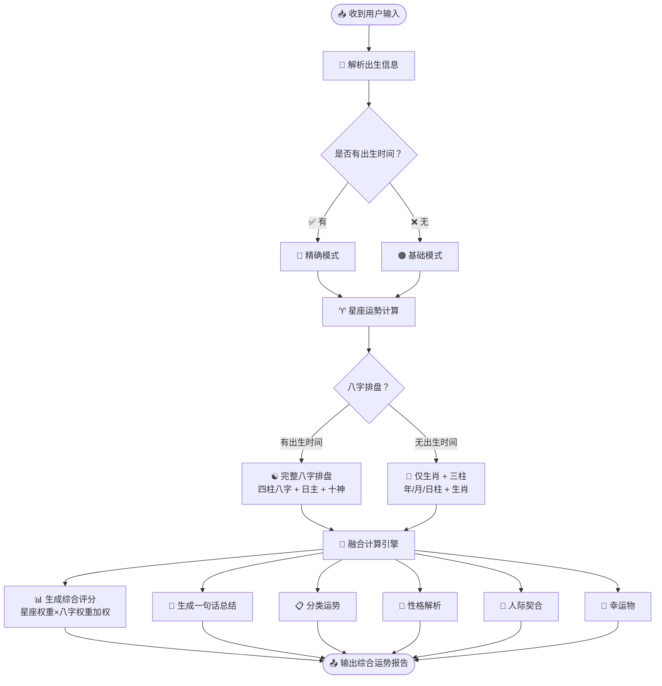
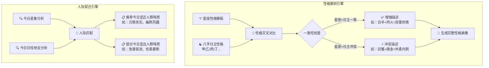

# ⚙️ 运势推算流程图 — 今日运势分析器

> 用户提交表单后，后台如何进行运势计算的全流程

---

## 第一层：计算主流程



---

## 第二层：核心计算逻辑拆解

```mermaid
flowchart TD
    subgraph 星座运势模块
        S1[📅 输入：月+日] --> S2[🗂 查找星座\n3/21-4/19 = 白羊座]
        S2 --> S3[🌟 获取今日星象数据\n太阳/月亮/行星位置]
        S3 --> S4[📊 计算星座运势分\n星座属性 + 今日星象相位]
        S4 --> S5[📝 生成星座运势文案\n事业/感情/财运/健康]
    end

    subgraph 八字命理模块
        B1[📅 输入：年+月+日+时] --> B2[🔢 排四柱八字\n年柱/月柱/日柱/时柱]
        B2 --> B3[👤 确定日主\n日柱天干 = 日主]
        B3 --> B4[⚖️ 十神分析\n比肩/劫财/食神/伤官/正财/偏财/正官/七杀/正印/偏印]
        B4 --> B5[📊 计算八字运势分\n日主与当日地支关系]
        B5 --> B6[📝 生成命理运势文案]
    end

    subgraph 生肖运势模块
        Z1[🐉 输入：出生年份] --> Z2[🗂 查找生肖\n年份 mod 12]
        Z2 --> Z3[📊 今日生肖运程\n生肖 × 今日地支]
        Z3 --> Z4[📝 生成生肖运势文案]
    end
```



---

## 第三层：综合评分融合算法

```mermaid
flowchart TD
    Start([各模块分数就绪]) --> Weights[⚖️ 权重配置]

    Weights --> W1[星座运势权重：40%]
    Weights --> W2[八字命理权重：40%]
    Weights --> W3[生肖运势权重：20%]

    W1 & W2 & W3 --> NoTime{有出生时间？}

    NoTime -->|✅ 有| FullWeight[应用完整权重\n星座40% + 八字40% + 生肖20%]
    NoTime -->|❌ 无| Fallback[降级权重\n星座60% + 生肖40%\n八字不可用]

    FullWeight --> Calc[🔢 综合评分 = Σ(模块分 × 权重)]
    Fallback --> Calc

    Calc --> Level{评分等级}
    Level -->|90-100| Great[🟢 大吉 · 运势极佳]
    Level -->|75-89| Good[🟢 吉 · 运势良好]
    Level -->|60-74| Normal[🟡 平 · 运势平稳]
    Level -->|40-59| Caution[🟠 小凶 · 需多注意]
    Level -->|0-39| Warning[🔴 大凶 · 谨慎行事]

    Great & Good & Normal & Caution & Warning --> Summary[💬 生成一句话总结\n结合最高分和最低分维度]
    Summary --> Output([输出综合评分 + 总结])
```

---

## 第四层：性格解析 & 人际契合逻辑



---

## 数据流说明

| 输入 | 处理 | 输出 |
|------|------|------|
| 出生年/月/日 | 查找星座 + 生肖 | 星座运势分 + 生肖运势分 |
| 出生年/月/日/时 | 排八字四柱 + 十神分析 | 八字运势分 + 日主性格 |
| 所有模块分 | 加权融合算法 | 综合评分 (0-100) |
| 最高/最低分维度 | 文案模板 + 动态组合 | 一句话总结 |
| 星座 + 日主 | 交叉对比引擎 | 性格解析 |
| 今日星象 + 日柱 | 人际匹配引擎 | 宜近/宜远人群特质 |

---

## 异常处理

| 异常 | 处理 |
|------|------|
| 出生日期为未来日期 | 提示"请输入正确的出生日期" |
| 出生年份早于 1900 | 提示"暂不支持 1900 年以前的日期" |
| 浏览器不支持某些特性 | 降级到基础模式（仅星座 + 生肖） |
| 计算超时 | 先展示已完成模块，其余显示"计算中..." |

---

*推算流程图 · 下一步：查看「系统模块关系图」了解整体架构*
