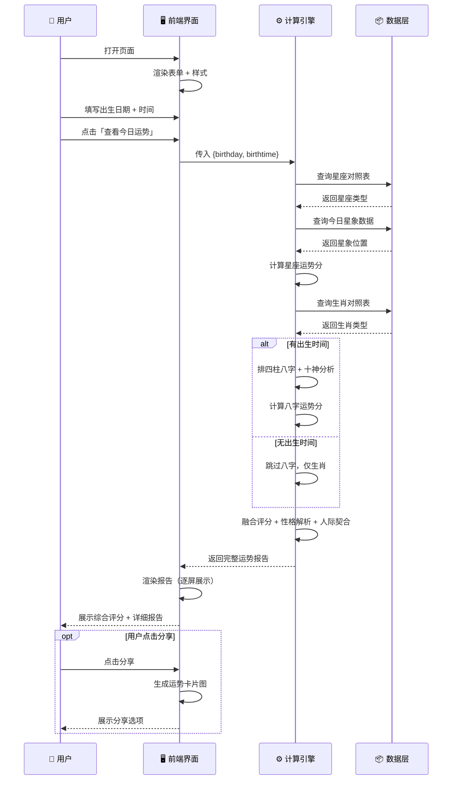
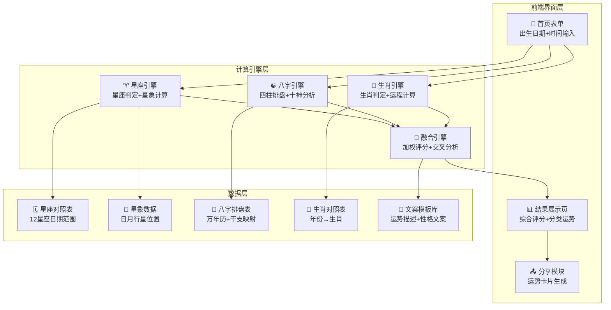
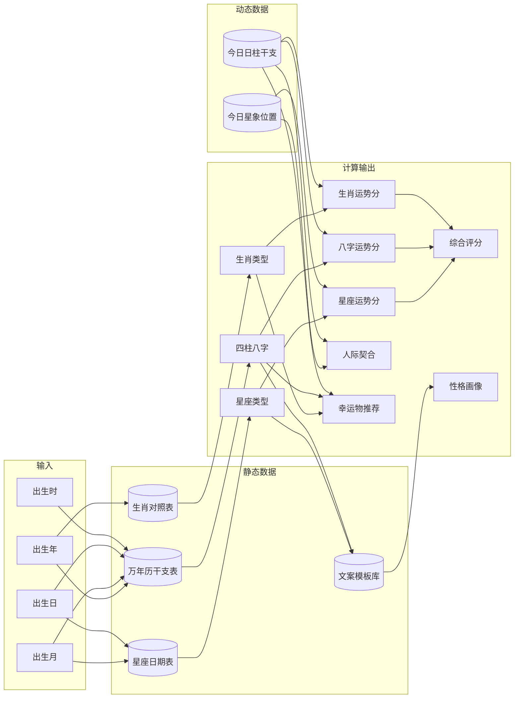

# 🏗 系统模块关系图 — 今日运势分析器

> 前端单页应用，纯客户端计算，无需后端服务器

---

## 第一层：前端与用户交互流



---

## 第二层：模块架构图



---

## 第三层：数据依赖关系



---

## 技术选型说明

| 层 | 技术 | 原因 |
|----|------|------|
| **界面** | HTML + CSS + Vanilla JS | 零依赖，打开即用 |
| **计算** | 纯客户端 JavaScript | 无需服务器，隐私安全 |
| **八字算法** | tyme4ts（参考）或自研 | 开源库成熟，可自实现 |
| **星象数据** | 静态内置（简化模型） | MVP 用简化算法，V2 可接 API |
| **分享卡片** | Canvas API | 浏览器原生支持，无需第三方 |
| **数据存储** | 不存储任何用户数据 | 出生信息敏感，完全本地计算 |

---

## MVP 技术边界

```
✅ 做：纯浏览器端计算，不收集/存储用户数据
✅ 做：静态数据内置（星座表、生肖表、干支表、文案模板）
✅ 做：简化星象模型（基于当前日期的数学推算）
❌ 不做：后端服务器 / API / 数据库
❌ 不做：实时星象 API 调用
❌ 不做：用户账号/登录系统
❌ 不做：付费/订阅系统
```

---

*系统架构图 · 所有流程图已完成*
