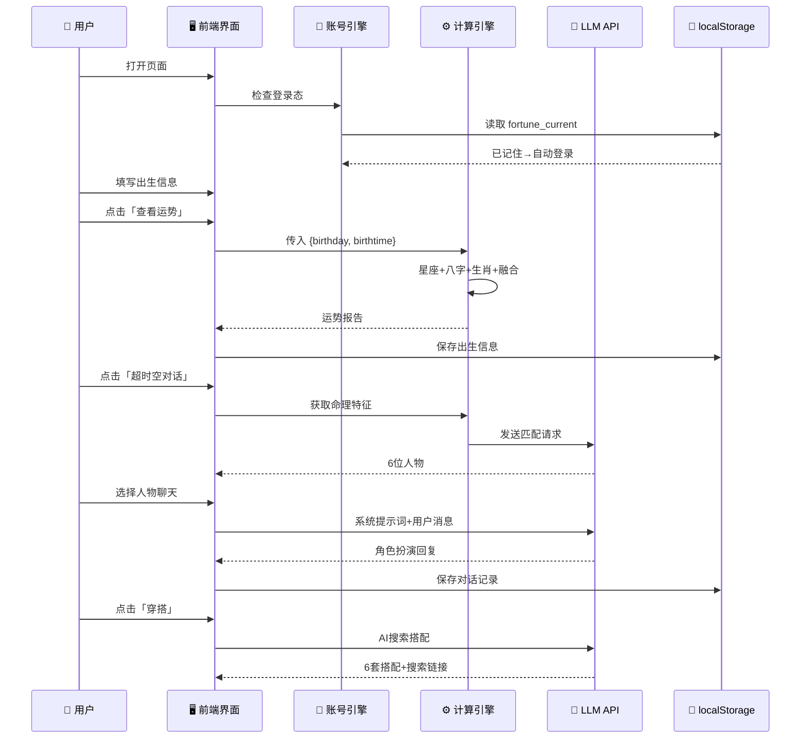
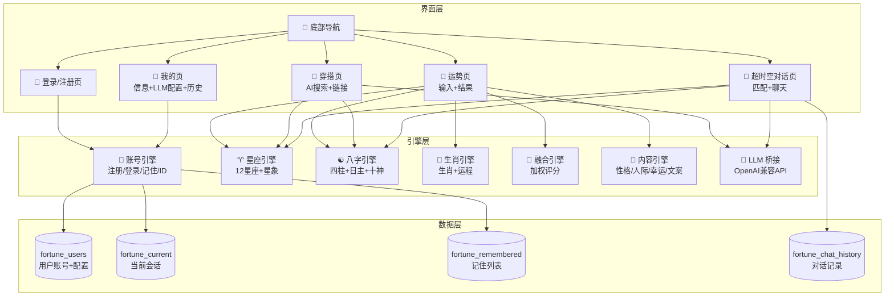
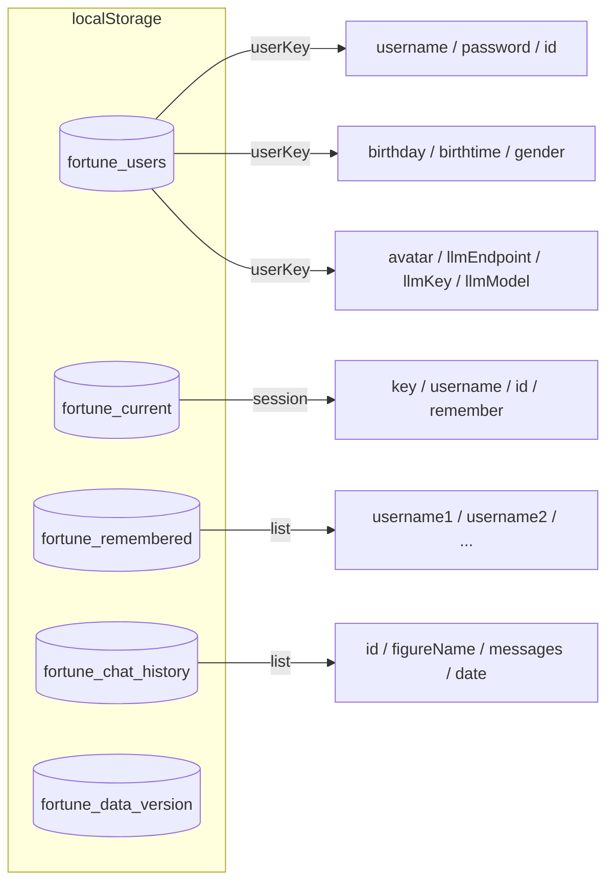

# 🏗 系统模块关系图 — 今日运势分析器 v2.0

> 单页应用，纯客户端计算，零后端服务器

---

## 第一层：用户交互流



## 第二层：模块架构



## 第三层：数据存储结构



## 技术栈

| 层 | 技术 | 说明 |
|----|------|------|
| 界面 | HTML + Tailwind CSS CDN | 黑底极简，响应式移动+桌面 |
| 动效 | CSS @keyframes + JS SplitText | 逐字入场/淡入/缩放/滑入 |
| 星座 | 纯 JS 算法 | 12星座日期判定+元素属性 |
| 八字 | 纯 JS 算法 | 五虎遁/五鼠遁/节气/万年历 |
| 融合 | 加权评分 | 有/无出生时间双权重 |
| LLM | fetch API | OpenAI 兼容，支持5家服务商 |
| 存储 | localStorage | 4组key，带版本号+容量保护 |
| 隐私 | 纯本地 | 无服务器/无数据库/无追踪 |

## 技术边界

```
✅ 纯 HTML/CSS/JS 单页应用
✅ Tailwind CSS CDN
✅ 客户端计算，零后端
✅ 5家 LLM 服务商预设
✅ 本地账号系统（localStorage）
❌ 无服务器 / API / 数据库
❌ 无第三方追踪 / 分析
❌ 敏感数据不上传
```

---

*系统架构图 v2.0 · 含LLM集成 + 账号系统*
