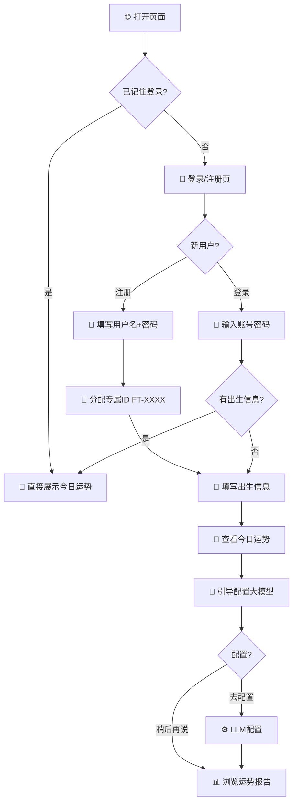
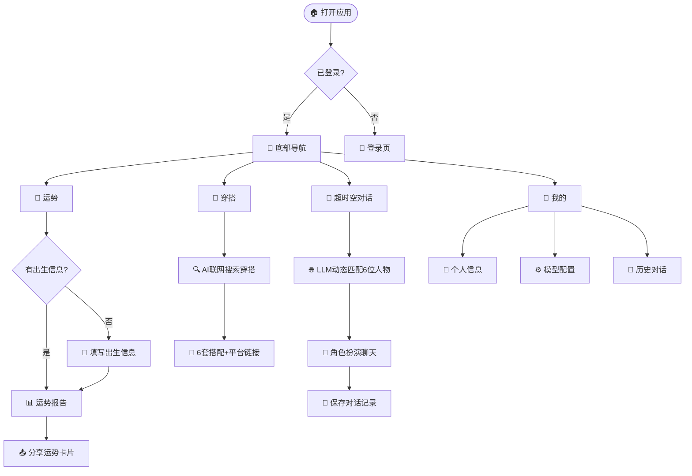
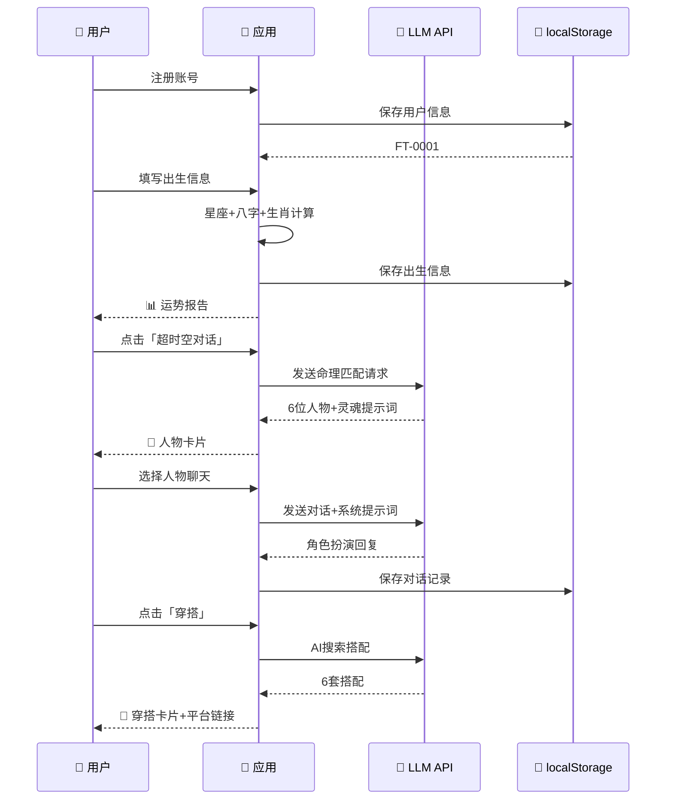

# 🗺 用户旅程图 — 今日运势分析器 v2.0

> 从首次登录到日常使用的完整用户旅程

---

## 第一层：首次用户旅程

## 第二层：日常使用旅程

## 第三层：核心功能互动

## 用户旅程文字说明 v2.0

| 阶段 | 用户心态 | 关键动作 | 系统响应 |
|------|---------|---------|---------|
| 🔐 **首次到达** | "需要注册吗" | 注册/登录 | SplitText 标题动画入场 |
| 📅 **填写信息** | "填个生日试试" | 输入出生日期+时间 | 表单校验 |
| 🔮 **运势生成** | "看看怎么说" | 点击查看运势 | 综合评分+分类运势 |
| 🚀 **引导配置** | "LLM是什么" | 弹窗引导→配置 | 跳转模型配置页 |
| 👕 **穿搭搜索** | "今天穿什么" | AI 联网搜索 | 6套搭配+平台链接 |
| 🌌 **超时空对话** | "谁和我的灵魂相似" | LLM 匹配人物 | 6位人物+相似度% |
| 💬 **角色聊天** | "和诸葛亮聊聊" | 输入消息 | AI 以人物人格回复 |
| 👤 **我的管理** | "修改一下信息" | 编辑资料/配置LLM | 保存同步 |
| 📤 **分享/离开** | "发朋友圈" | 生成分享卡片 | 运势卡片展示 |

---

*用户旅程图 v2.0 · 涵盖完整4Tab流程*
