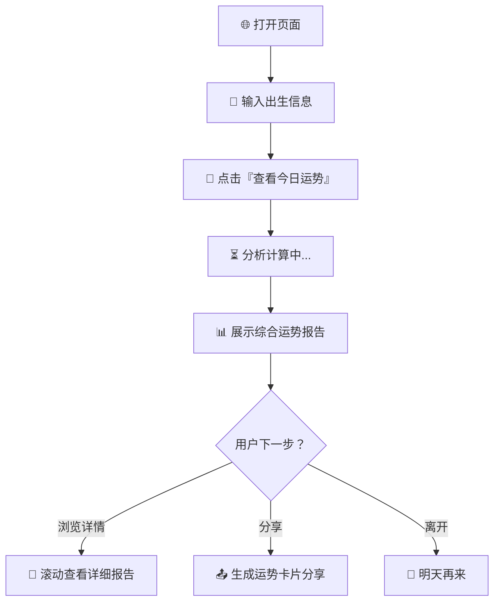
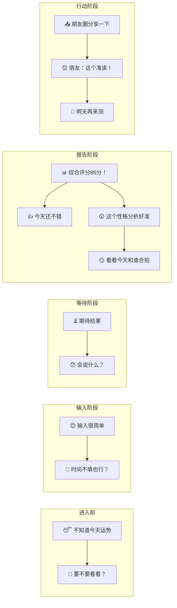

# 🗺 用户旅程图 — 今日运势分析器

> 主流程：用户从打开页面到看完报告、决定分享的完整路径

---

## 第一层：鸟瞰图（Happy Path）



> 📝 用户的核心任务：**输入 → 等待分析 → 看报告**。3 步内到达核心价值。

---

## 第二层：详细用户旅程（含交互细节）

```mermaid
flowchart TD
    Start([🏠 用户打开页面]) --> Landing[📱 看到首页]
    Landing --> Hero[🎯 标题：今日运势分析器\n副标题：星座 × 传统命理]
    Hero --> Form[📋 填写表单]

    Form --> Birthday[📅 选择出生年月日 *必填]
    Birthday --> TimeInput{⏰ 是否填写出生时间？}
    TimeInput -->|填了| HasTime[✅ 精确模式：八字排盘可用]
    TimeInput -->|跳过| NoTime[⚠️  基础模式：仅星座+生肖]

    HasTime --> Submit[🔮 点击提交按钮]
    NoTime --> Submit

    Submit --> Validate{表单校验}
    Validate -->|未填日期| Error1[🔴 提示：请填写出生日期]
    Error1 --> Birthday
    Validate -->|通过| Loading[⏳ 加载动画：『正在推演今日运势...』]

    Loading --> Calc[⚙️ 后台并行计算]
    Calc --> Result[📊 展示结果页面]

    Result --> Score[🔢 第一屏：综合评分 + 一句话总结]
    Score --> Detail[📋 第二屏：分类运势\n事业 | 感情 | 财运 | 健康]
    Detail --> Personality[🧠 第三屏：性格解析\n星座性格 × 八字日主]
    Personality --> Compat[🤝 第四屏：今日人际契合\n宜近/宜远人群特质]
    Compat --> Lucky[🎨 第五屏：今日幸运物\n幸运色 | 数字 | 方位]

    Lucky --> Action{用户行为}
    Action -->|📤 分享| Share[生成运势卡片 → 复制/下载/朋友圈]
    Action -->|🔄 重算| Birthday
    Action -->|👋 关闭| End([明天再来])
    Action -->|💾 截图| Screenshot[保存运势卡片到相册]
```

---

## 第三层：用户心理旅程



---

## 用户旅程文字说明

| 阶段 | 用户心态 | 关键动作 | 系统响应 |
|------|---------|---------|---------|
| 🏠 **到达** | "看看这是什么" | 打开页面 | 展示首页 + 表单 |
| 📋 **填写** | "填个生日试试" | 选日期 + (可选)时间 | 校验表单 |
| 🔮 **提交** | "看看怎么说" | 点击按钮 | 加载动画 + 后台计算 |
| 📊 **第一印象** | "85 分？还不错" | 看到综合评分 | 大数字 + 一句话总结 |
| 📜 **深度阅读** | "事业运怎么样？" | 滚动浏览各板块 | 分类运势逐屏展示 |
| 🧠 **惊喜时刻** | "性格分析好准！" | 读到性格解析 | 星座×八字交叉性格 |
| 🤝 **共鸣时刻** | "今天跟XX型人合拍" | 看人际契合 | 今日动态人际匹配 |
| 📤 **分享/离开** | "发朋友圈" 或 "明天再来" | 生成卡片或关闭 | 生成分享图 |

---

*用户旅程图 · 下一步：查看「运势推算流程图」了解后台计算逻辑*
